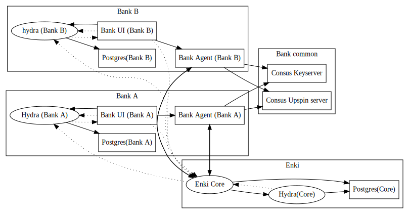

# Enki architecture

## Repositories

Split over several. The core platform (ie: the central data registry) stuff lives in [`enki-core`](../../core). The demo bank lives in [`enki-bank-web-ui`](../../bank-web-ui)`.

There's also an end-to-end set of tests in [`ereshkigal`](../../ereshkigal), which is run as part of the main Jenkins build.

The various docker images we use are found in [`enki-docker`](../../docker).

The core consus components are built from [`enki-upspin`](../../upspin).

[`enki-common`](../../common) contains shared utilities.

[`enki-agent`](../../agent) contains the bank agent application.

[`enki-demo-suite`](../../demo-suite) contains the demo suite (basically a how-to).

## Smoke test

As mentioned earlier, once all resources have converged to their desired state, we use [ereshkigal](../../ereshkigal) to perform an end-to-end smoketest of the workflow used in our demo. This uses a browser (via `webdriver`) to perform the steps a user would.

## Runtime deps.

This is a map of what services need to know about each other.

Use `dot -Tsvg docs/services.dot -o docs/services.svg` to update.

* Elliptical boxes are k8s Deployments
* Boxes are k8s StatefulSets.
* solid lines are direct service->service communication
* dashed lines are via the browser (eg: via redirects).

## Scope for structural improvement.

* Too many services require local state. Eg:
  * Bank web ui should use an external database, not sqlite.
  * Bank agent should store keys in the k8s store, not just a random bit of filesystem.
* Rolling our own postgres deployment
  * Ideally, we'd use someone else's, or even better, provision RDS instances via a custom kubernetes object.
* Upspin for secret storage.
  * It uses its own set of cryptography, which means that if we want proper end to end cryptography, we need to find a way to integrate its key/identity management with Bletchley.
  * The only interface it presents are command line tools intended for human users. so, for example, you need to parse the output in order to learn which errors may have occurred.
