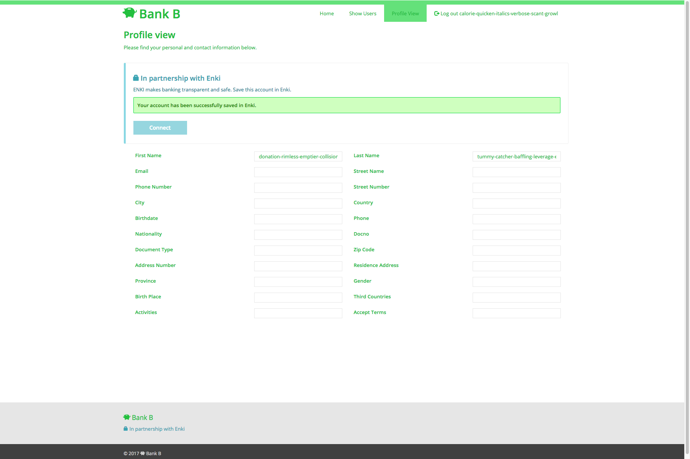

## Terminology

| Term         | Definition  |
|--------------|-------------|
| Enki         | The core Enki service. Enki Core collects consent data relating to PII Data. Enki is a data processor as defined in the GDPR. It does NOT store PII information, only metadata (what is stored where and shared with whom for how long). |
| Consent Data | Data relating to an individual data subject’s (referenced by their Enki ID) agreement for the time bounded use of PII in relation to a specific activity.  |
| Consus       | A cryptographically secure PII store.
| PII          | Personally Identifiable Information: anything that can be used to identify an individual.  |
| PII Data     | Refers to the piece of data that embodies the PII, such as the data subject’s name, passport copy, or a credit reference  |
| Bletchley    | A cryptography and message serialisation framework written with utmost security as top priority.  |
| Enki Agent   | Agent running at a partner organisation’s side to coordinate and validate the storage/retrieval of data.  |
| Metadata     | Data about a piece of data. e.g. when it was created. |
| Data Subject     | A natural person whose personal data is processed by a Controller or Processor. |
| Data Controller  | The entity that determines the purposes, conditions and means of the processing of personal data. |
| Data Processor   | The entity that processes data on behalf of the Data Controller. |

## User Journey

### The following steps describe the user journey of how Enki can be used to transfer a user’s (Alice) already validated PII data from one bank (BankA) to a second bank (BankB) using Enki.

1. Alice is a client of BankA. She logs in to the BankA website and looks at her profile.

2. Alice returns to BankA. She goes to the profile view. She sees a prompt about connecting this account with Enki and she clicks "Connect".

3. Alice goes to Enki and signs up for an account.

.png)

.png)

4. In the process of signing up with Enki, a username and password is stored.

.png)

5. Alice opts to link Enki account with BankA.

.png)

6. Alice logs into BankA.

7. Alice grants Enki permissions to access the "open id" scope and she is redirected to Enki home page.

.png)

8. Alice goes to the Enki Dashboard and sees PII metadata entered during BankA signup in Enki.

.png)
.png)

9. Alice goes to BankB and uses the 'Existing Enki account' button to sign up.

10. Alice is forwarded to Enki and is asked which data BankB is allowed to use.

11. Alice is returned to BankB which now has received BankA’s data.

12. Alice completes the BankB registration process filling in the missing pieces.

13. Alice goes to Enki and links account with BankB.

.png)

.png)

.png)

14. Alice now goes to Enki and can see assertions from both BankA and BankB

.png)
.png)

