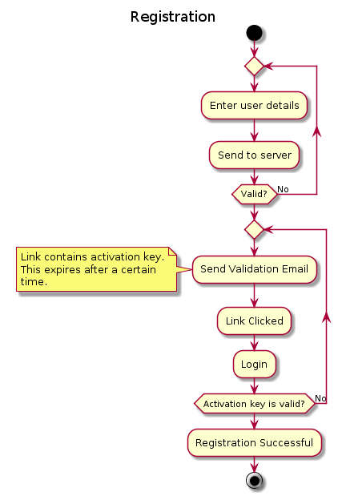

## Diagram



Raw code:
```
@startuml

title Registration

start

repeat
  :Enter user details;
  :Send to server;
repeat while (Valid?) is (No)

repeat
    :Send Validation Email;
    note left
        Link contains activation key.
        This expires after a certain
        time.
    end note
    :Link Clicked;
    :Login;

repeat while (Activation key is valid?) is (No)

:Registration Successful;

stop


@enduml
```

[PlantText](https://www.planttext.com/) was used to generate the image.
