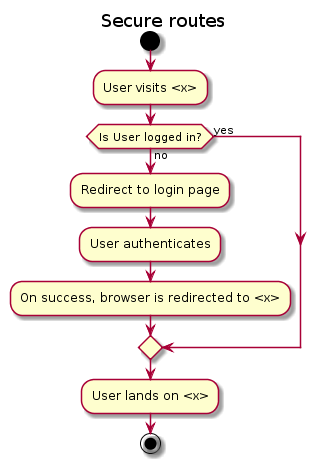

When the user visits a URL which has the `wrap-authorization` and `wrap-authenticated` applied, we check if the user is logged in by checking if for that session there is `:identity` keyword in it. If not, we redirect the user to the login screen with the `next` query parameter added. On success the user is redirected to the original URL.

Raw code:
```
@startuml

title Secure routes

start

:User visits <x>;

if (Is User logged in?) then (yes)

else (no)
  :Redirect to login page;
  :User authenticates;
  :On success, browser is redirected to <x>;
endif

:User lands on <x>;

stop

@enduml
```

[PlantText](https://www.planttext.com/) was used to generate the image.